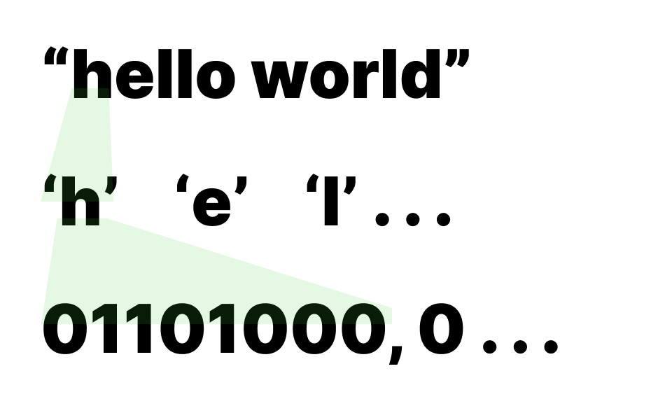
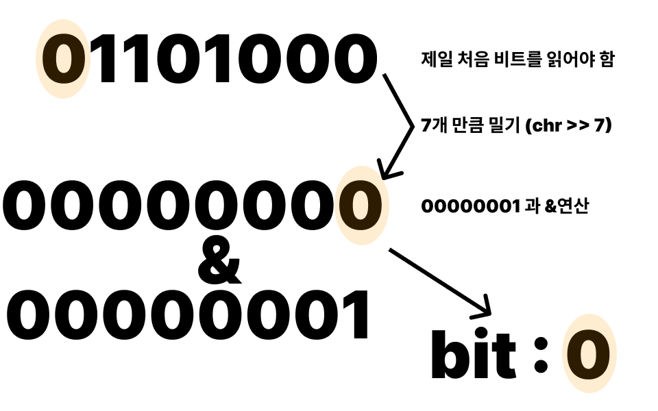
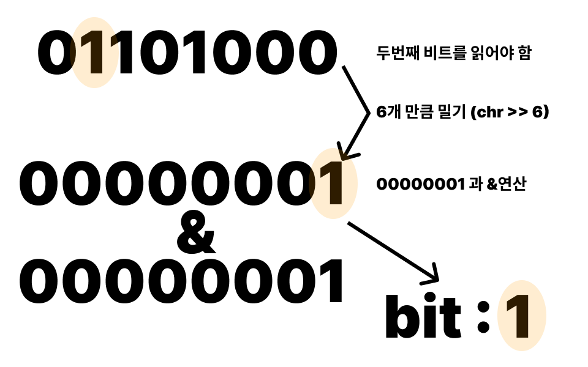
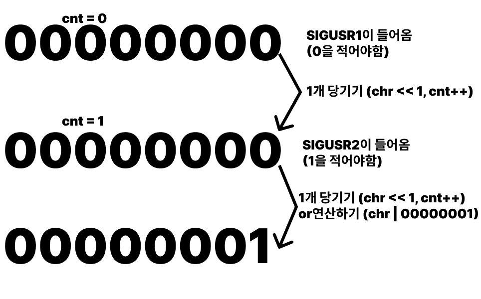

[영어 서브젝트](https://cdn.intra.42.fr/pdf/pdf/35917/en.subject.pdf)<br>
[한글 서브젝트](./ko_sub.md)<br>
[가이드](https://dc-choi.tistory.com/63)<br>

## 아이디어

이 과제는 서버 프로그램과 클라이언트 프로그램을 만들어 유닉스 시그널을 이용해 통신한다. 클라이언트는 서버로 문자열을 전송해야 한다. 우리가 사용할 수 있는 시그널은 오직 SIGUSR1과 SIGUSR2이다.
<br>

2개의 시그널만 사용할 수 있으므로 2진법 체계를 이용해서 통신을 해야한다.
<br>

문자열(string)을 쪼개면 문자열 길이만큼의 문자(char)가 되고 문자를 다시 쪼개면 8개의 비트(bit) 가 된다. 우리는 문자열을 두번 쪼개서 비트단위로 시그널을 전송해야 한다.
<br>


<br><br>

클라이언트는 비트를 하나씩 읽으며 0일때는 SIGUSR1을 1일때는 SIGUSR2를 보내기만 하면 된다. 시그널을 보내는 명령어는 kill이다.<br>
``` c
if (bit == 0)
	kill(pid, SIGUSR1);
else if (bit == 1)
	kill(pid, SIGUSR2);
```
<br><br>

비트를 읽는 방법으로는 비트쉬프트와 비트연산자를 사용한다. 필요한 만큼 밀어준 후 1(00000001)과 &(and)연산을 수행하면 비트를 구할 수 있다.

``` c
i = 7;
while (i >= 0)
{
	bit = (chr >> i) & 1;
	.
	.
	.
}
```
<br>
<br>
<br>
<br><br>

클라이언트는 위의 방법을 반복하면 된다. 
<br><br>
서버는 실행될 때 자신의 프로세스 아이디(pid)를 출력한다. pid는 클라이언트가 시그널을 보낼때 필요하므로 클라이언트 프로그램을 실행할때 인자로 넣어준다.
<br>
```c
ft_printf("pid: %d\n", getpid());
signal(SIGUSR1, get_signal);
signal(SIGUSR2, get_signal);
while (1)
	pause();
```
시그널이 들어왔을때 동작을 정의해주고 시그널이 들어올때까지 pause(대기)한다.
<br><br>
static변수 chr과 cnt가 0으로 초기화 된다. chr을 한칸씩 당겨준 후 SIGUSR2가 들어왔다면 1을 적어야 하므로 1(00000001)과 |(or)연산을 한다.
```c
static void	get_signal(int signal)
{
	static char	chr;
	static int	cnt;

	chr <<= 1;
	cnt++;
	if (signal == SIGUSR2)
		chr |= 1;
	.
	.
	.
}
```
<br>

<br>
<br>

8개의 비트가 들어올 때마다 하나의 문자를 만들어 출력한다. cnt와 chr은 다시 0으로 초기화 되어 다음 문자를 받을 준비를 한다.
```c
if (cnt == 8)
{
	ft_putchar_fd(chr, 1);
	cnt = 0;
	chr = 0;
}
```