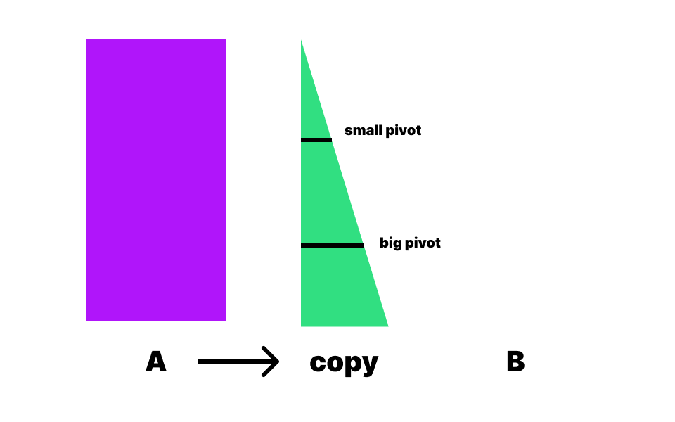

### 참고 자료
[한글 서브젝트](./ko_sub.md) 
[영어 서브젝트](https://cdn.intra.42.fr/pdf/pdf/49387/en.subject.pdf) 
[그리디 알고리즘 설명](https://techdebt.tistory.com/27) (케이크)
[소스코드](https://github.com/JeonYoungHo-youjeon/push_swap/blob/master/push_swap.h) 
[libft사용하기(cc -L -l](https://velog.io/@hidaehyunlee/외부-라이브러리-GCC로-컴파일-하기) 
[libft사용하기(make -C 옵션)](https://wiki.kldp.org/KoreanDoc/html/GNU-Make/GNU-Make-5.html) 
[tester](https://github.com/LeoFu9487/push_swap_tester)

 

### 방법 설명

 

- 처음 상태 : 무작위 순서의 정수 배열이 스택 a에 저장되어있다.

 

- copy 스택 생성 : a스택을 복사한 copy 스택을 만든다. copy스택을 버블정렬으로 정렬하고 피벗 2개를 찾는다.

 

- 나누기 : 피벗을 기준으로 3개의 그룹으로 나눈다.

 

- 3개 정렬 : 3개를 제외하고 모두 b로 넘겨서 나머지 3원소를 정렬한다.

 

- 그리디 알고리즘 : 반복문을 이용해서 b가 빌때까지 그리디 알고리즘을 사용해 b의 원소를 a로 옮긴다.

 

- 정리 : ra 또는 rra를 사용해서 a를 정리해 마무리 한다.

 

### 파일 목록

| file name | functions | explanation |
|:--:|:--:|:--:|
| [ft_doubly_circular_list.c](./README_dc.md) | ft_dc_lstnew ft_dc_lstadd_front ft_dc_lstdel_front ft_dc_lstsize ft_dc_lstclear | 이중 연결 리스트 자료형을 사용하기위한 함수들 |
| [swap.c push.c rotate.c reverse_rotate.c](./README_stack.md) | sa, sb, ss, pa, pb,  ra, rb, rr, rra, rrb, rrr   | [규칙 보기](https://github.com/HaiSeong/seoul42_course/blob/main/push_swap/ko_sub.md#v1-게임-규칙)|
| [push_swap.c](./README_push_swap.md) | ft_free_strs, make_a, main | main함수가 있는 파일 |
| [push_swap_util.c libft](./README_push_swap_util.md) | ft_atolli, ft_split_isspace, ft_isspace | util 함수들 |
| ft_error.c | ft_error, ft_error_exit, ft_error_free_a_exit, ft_error_free_a_copy_exit | 에러처리 함수 |
| [sorting_before.c](./README_sort_before.md) | copy_a, bubble_sort, check, get_small_pivot, get_big_pivot | 정렬 전 필요한 함수들 |
| [sorting.c](./README_sort.md) | sort2, sort3, move_all_b, organize_stack | 정렬 관련 함수들 |
| [calculate_cost1.c calculate_cost2.c](./README_cal_cost.md) | get_ra_cost, set_cost_info_a, set_cost_info_b, cal_sum_cost1, cal_sum_cost2, get_best_cost | b에서 a로 넘기는 최저 비용고 정보를 구하는 함수 |
| [rotate_best_cost.c](./README_rotate_best.md) | rotate_best_cost, rotate1, rotate2, rotate3, rotate4  | 최적의 상태로 돌리는 함수 |
